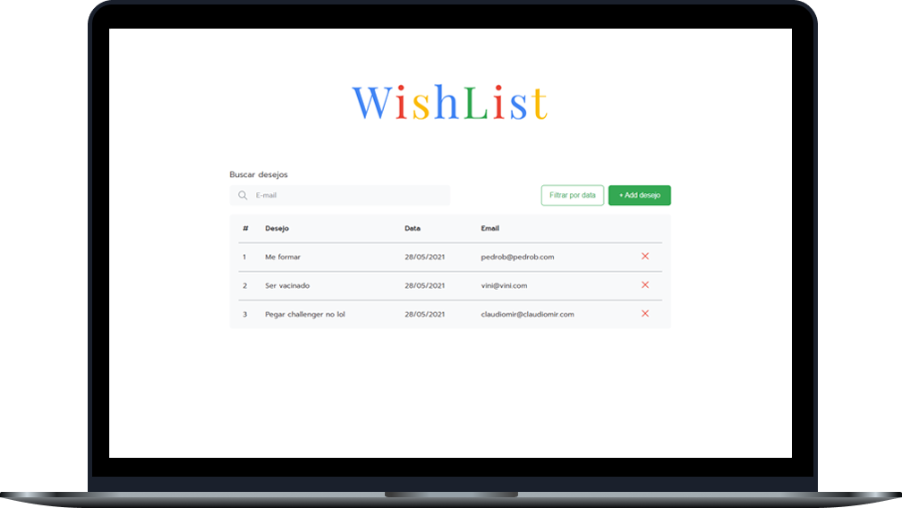
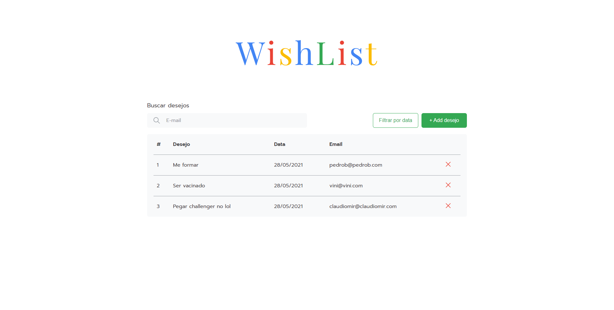
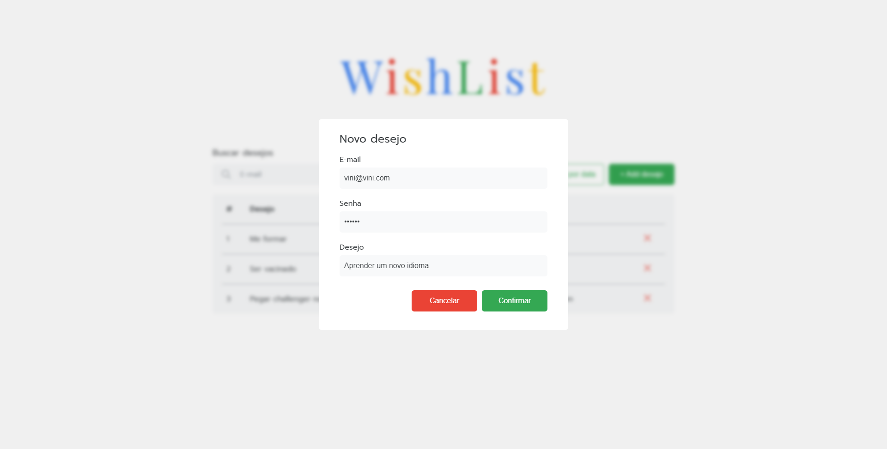

<h1 align="center">
  
</h1>
 
 

  

 

## Sobre o projeto 💬
O **WishList** é uma simples aplicação web onde é possível cadastrar, listar, excluir, e filtrar todos os seus desejos. Quais? O que você quiser! Os dados são armazenados em um banco de dados, podem ser acessados e alterados pela API que por sua vez é consumida pela UI que exibe para o usuário as informações

Para desenvolver esta aplicação foi utilizado metodologias ágeis Scrum e Kanban, facilitando a organização, designação de tarefas e definição de prazos de entrega.

Além de mim, os desenvolvedores que participaram deste projeto, foram: *[Pedro Brito](https://github.com/vinixiii)*, *[Claudiomir](https://github.com/vinixiii)*, e *[Pedro Alves](https://github.com/vinixiii)*

## Páginas 📄
Essa aplciação possui apenas uma página e um modal:
<h3 align="center">Home</h3>

  

<h3 align="center">Home-Modal</h3>

  

## Funcionalidades 📌
A aplicação contém todas as seguintes funcionalidades:
- Exibir todos os desejos cadastrados
- Cadastrar um novo desejo
- Excluir um desejo
- Filtrar por data mais recente ou mais antiga
- Filtrar os desejos de um usuário pelo e-mail

Além disso, possui validações na UI que trazem uma ótima experiência ao usuário.

## Tecnologias 🛠
Desenvolvido utilizando as seguintes tecnologias:
- [React](https://reactjs.org)
- [C#](https://docs.microsoft.com/pt-br/dotnet/csharp/)
- [ASP.NET Core](https://docs.microsoft.com/pt-br/aspnet/core/?view=aspnetcore-5.0)
- [SQL Server](https://docs.microsoft.com/pt-br/sql/?view=sql-server-ver15)

---

Feito com ❤ por: Vinícius Figueiroa 🙋🏻‍♂️
